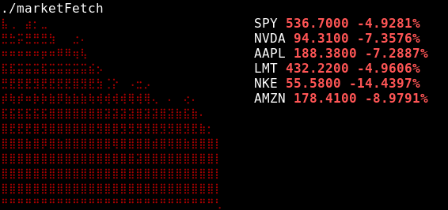

# **** Description 
    A simple Neofetch-like terminal tool to display how the stock market is trending.
    Prints out either a green or a red graph, depending on how the S&P500 is doing. 
    Also prints out a couple of other stocks below.
    Example:

# **** Usage
    I've not propperly packaged the program yet, but it can be run by running ./a.out 

# **** TODO
    - Package into:
        - Debian (.deb)
        - Fedora (.rpm)
        - Linux Generic (.tar.gz)
        - Mac (i dont know what package format mac uses)

